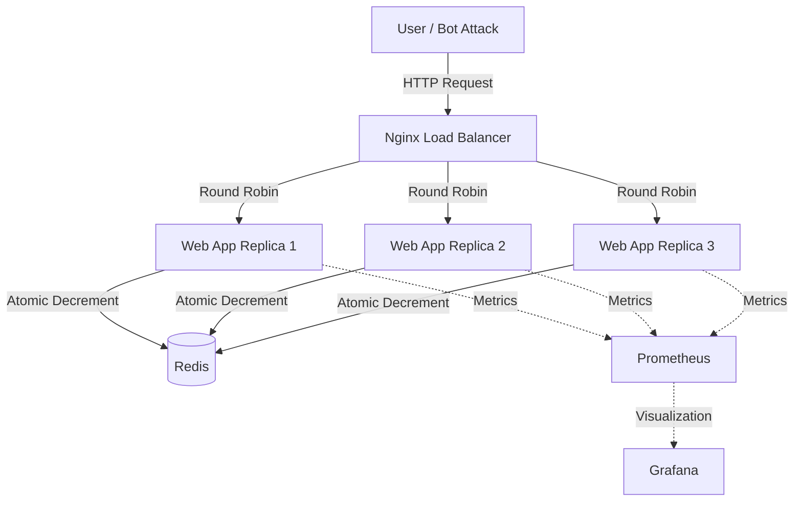

# 🚀 iPhone 17 Launch — Flash Sale Microservices System


> **Cloud Architecture Simulation for High-Concurrency Flash Sale Events**

Proyek ini merupakan simulasi sistem **Flash Sale** untuk peluncuran **iPhone 17 Pro Max (2025)**.  
Sistem dibangun menggunakan arsitektur **Microservices** untuk menangani **traffic ekstrem** dengan karakteristik:

- ⚡ High concurrency  
- ❌ Zero downtime  
- 🛡️ Zero overselling (anti stok minus)

---

## 🌟 Key Features

| Fitur | Deskripsi | Teknologi |
|------|----------|-----------|
| 🛡️ **Race Condition Proof** | Menjamin stok tetap akurat meskipun 1000+ request/detik | Redis Atomic Operation |
| ⚖️ **Load Balancing** | Distribusi beban otomatis ke beberapa replika server | Nginx (Round Robin) |
| ❤️ **Self-Healing System** | Container otomatis pulih saat terjadi kegagalan | Docker Compose |
| 👁️ **Observability** | Monitoring trafik sukses vs gagal secara real-time | Prometheus & Grafana |
| 💎 **Modern UI** | Tampilan frontend bertema *Apple Event* | HTML5 & CSS3 |

---

## 🏗️ System Architecture

Seluruh sistem berjalan dalam lingkungan **containerized microservices** dengan alur sebagai berikut:



---

## 📂 Struktur Folder

```text
flash-sale-project/
├── docker-compose.yml      # Orkestrator Utama (Jantung Sistem)
├── prometheus.yml          # Konfigurasi Monitoring
├── bot_attack.py           # Script Stress Test (Simulasi Serangan)
├── nginx/
│   └── nginx.conf          # Konfigurasi Load Balancer
└── app/
    ├── Dockerfile          # Resep Image Aplikasi
    ├── requirements.txt    # Dependensi Python
    ├── app.py              # Backend Logic
    ├── static/
    │   └── iphone17pro.png # Aset Gambar
    └── templates/
        └── index.html      # Frontend UI
```

---

## ⚡ Panduan Instalasi (Quick Start)

### Prasyarat

- [Docker Desktop](https://www.docker.com/products/docker-desktop) (Running)
- Python 3.x *(Opsional, untuk script bot)*

---

### 1️⃣ Clone & Build

```bash
git clone https://github.com/USERNAME_KAMU/repo-ini.git
cd repo-ini
docker-compose up -d --build
```

---

### 2️⃣ Akses Aplikasi

Buka browser favorit Anda dan kunjungi:  
👉 **http://localhost**

---

## 🧪 Skenario Pengujian (Demo Script)

### 🟢 Skenario A — Load Balancing Check

1. Buka `http://localhost`
2. Klik **BELI SEKARANG** beberapa kali
3. Perhatikan teks: `Dilayani oleh Node: [ID Container]`

✅ **Hasil:**  
ID container berubah-ubah → load balancing berjalan

---

### 🔴 Skenario B — Stress Test (High Traffic)

Mensimulasikan **500 pembeli bersamaan**:

```bash
pip install requests
python bot_attack.py
```

✅ **Hasil:**  
- Log terminal bergerak cepat  
- Stok berhenti tepat di **0**  
- ❌ Tidak ada stok minus

---

### 💥 Skenario C — Chaos Engineering (Fault Tolerance)

1. Cek container aktif:
```bash
docker ps
```

2. Matikan paksa salah satu container web:
```bash
docker kill NAMA_CONTAINER_WEB
```

3. Website tetap dapat diakses (failover sukses)

4. Recovery sistem:
```bash
docker-compose up -d
```

✅ **Hasil:**  
Container otomatis hidup kembali

---

## 📊 Setup Monitoring (Grafana Dashboard)

1. Akses **http://localhost:3000**  
   Login: `admin / admin`
2. Add Data Source → **Prometheus**
3. URL:
```text
http://prometheus:9090
```

4. Buat Dashboard → Add Visualization  
5. Gunakan query berikut:

```promql
sum(rate(flash_sale_requests_total[1m])) by (status)
```

📈 Jalankan stress test dan lihat lonjakan trafik secara real-time

---

## 👨‍💻 Author

| Nama | NIM | Peran |
|------|-----|------|
| **M Alief Alfaridzi** | 1203230045 | Cloud Architect & Backend |
| **Rafif Muhammad** | 1203230018 | Frontend & Documentation |

**Informatika — Universitas Telkom**  
*Tugas Besar Mata Kuliah Komputasi Awan & Terdistribusi (2025)*

---

Made with ❤️ and ☕ using **Docker**
