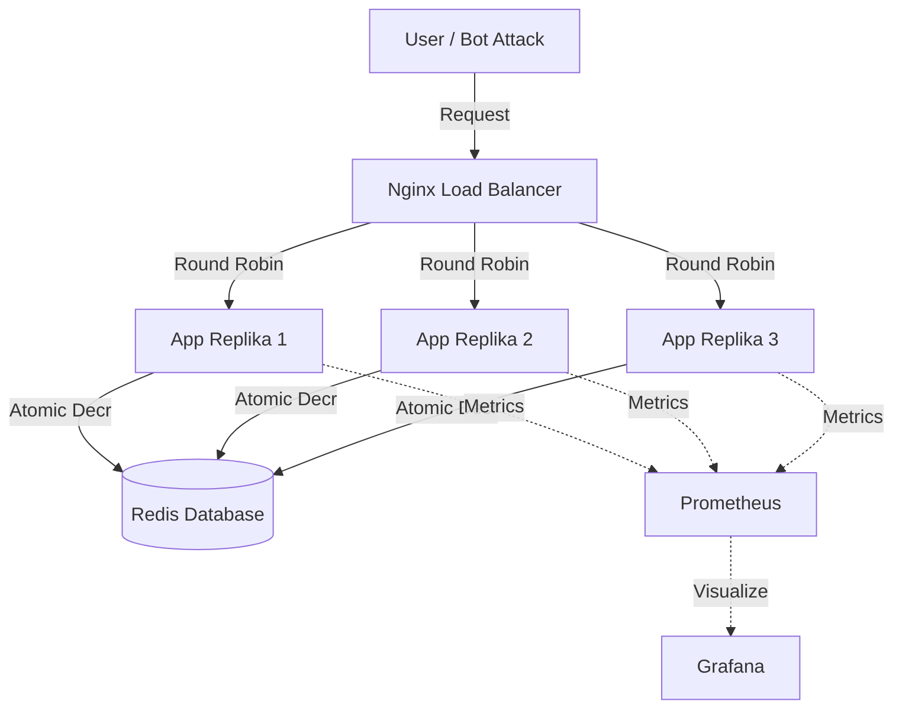

```markdown
# 🚀 iPhone 17 Launch: Flash Sale Microservices System


> **Cloud Architecture Simulation for High-Concurrency Events.**

Proyek ini adalah simulasi sistem *Flash Sale* untuk peluncuran **iPhone 17 Pro Max** di tahun 2025. Dibangun menggunakan arsitektur **Microservices** yang dirancang untuk menangani jutaan request per detik tanpa *downtime* dan menjamin **Zero Overselling** (Anti Stok Minus).

---

## 🌟 Fitur Unggulan (Key Features)

| Fitur | Deskripsi | Teknologi |
| :--- | :--- | :--- |
| **🛡️ Race Condition Proof** | Menjamin stok akurat 100% meski diserang 1000+ request/detik. | Redis Atomic Locks |
| **⚖️ Load Balancing** | Membagi beban trafik secara otomatis ke 3 replika server. | Nginx (Round Robin) |
| **❤️ Self-Healing** | Kemampuan pemulihan sistem otomatis saat terjadi kegagalan server. | Docker Compose |
| **👁️ Observability** | Monitoring trafik *real-time* (Sukses vs Gagal). | Prometheus & Grafana |
| **💎 Modern UI** | Antarmuka pengguna tema "Apple Event" yang responsif. | HTML5/CSS3 |

---

## 🏗️ Arsitektur Sistem

Sistem ini berjalan di atas isolasi container dengan alur kerja sebagai berikut:



---

## 📂 Struktur Folder

```text
flash-sale-project/
├── docker-compose.yml      # Orkestrator Utama (Jantung Sistem)
├── prometheus.yml          # Konfigurasi Monitoring
├── bot_attack.py           # Script Stress Test (Simulasi Serangan)
├── nginx/
│   └── nginx.conf          # Konfigurasi Load Balancer
└── app/
    ├── Dockerfile          # Resep Image Aplikasi
    ├── requirements.txt    # Dependensi Python
    ├── app.py              # Backend Logic
    ├── static/
    │   └── iphone17pro.png # Aset Gambar
    └── templates/
        └── index.html      # Frontend UI

```

---

## ⚡ Panduan Instalasi (Quick Start)

### Prasyarat

* [Docker Desktop](https://www.docker.com/products/docker-desktop) (Running)
* Python 3.x (Optional, untuk script bot)

### 1. Clone & Build

```bash
# Clone repository ini
git clone [https://github.com/USERNAME_KAMU/repo-ini.git](https://github.com/USERNAME_KAMU/repo-ini.git)

# Masuk ke folder
cd repo-ini

# Jalankan sistem (Build & Run)
docker-compose up -d --build

```

### 2. Akses Aplikasi

Buka browser favorit Anda dan kunjungi:
👉 **http://localhost**

---

## 🧪 Skenario Pengujian (Demo Script)

Gunakan skenario ini saat presentasi untuk membuktikan keandalan sistem.

### 🟢 Skenario A: Load Balancing Check

1. Buka website `http://localhost`.
2. Klik tombol **BELI SEKARANG** beberapa kali.
3. Perhatikan teks: `Dilayani oleh Node: [ID Container]`.
4. **Hasil:** ID Container akan berubah-ubah, membuktikan Nginx sukses membagi beban.

### 🔴 Skenario B: Stress Test (High Traffic)

Mensimulasikan serangan 500 pembeli secara bersamaan.

1. Pastikan library python terinstall: `pip install requests`
2. Jalankan script bot di terminal:
```bash
python bot_attack.py

```


3. **Hasil:** Log terminal akan bergerak cepat. Stok akan berhenti tepat di angka `0`. Tidak ada stok minus!

### 💥 Skenario C: Chaos Engineering (Fault Tolerance)

Simulasi kegagalan server dan pemulihan sistem menggunakan konsep **Desired State Configuration**.

1. Cek daftar container yang hidup:
```bash
docker ps

```


2. **SABOTASE:** Matikan paksa salah satu container web (misal `flash-sale-web-1`):
```bash
docker kill [NAMA_CONTAINER_WEB]

```


3. **VERIFIKASI:** Cek `docker ps`, container tersebut **HILANG**.
* *Note: Website localhost tetap bisa diakses karena beban dialihkan ke replika lain.*


4. **RECOVERY (Desired State):** Perintahkan orkestrator untuk menyinkronkan kembali jumlah server:
```bash
docker-compose up -d

```


5. **HASIL:** Cek `docker ps` lagi. Container pengganti otomatis hidup kembali (*Status: Up less than a second*).

---

## 📊 Setup Monitoring (Grafana Dashboard)

Untuk melihat grafik "Perang Flash Sale" secara live:

1. Buka **http://localhost:3000** (Login: `admin` / `admin`).
2. Klik **Add your first data source** ➔ Pilih **Prometheus**.
3. URL: `http://prometheus:9090` ➔ Klik **Save & Test**.
4. Buat Dashboard Baru ➔ **Add Visualization**.
5. Masukkan Query Trafik ini di mode **Code**:
```promql
sum(rate(flash_sale_requests_total[1m])) by (status)

```


6. Klik **Run Queries** dan lihat grafik melonjak saat *Stress Test* dijalankan!

---

## 👨‍💻 Author

| Nama | NIM | Peran |
| --- | --- | --- |
| **M Alief Alfaridzi** | 1203230045 | Cloud Architect & Backend |
| **Rafif Muhammad** | 1203230018 | Frontend & Documentation |

**Informatika - Universitas Telkom**
*Tugas Besar Mata Kuliah Komputasi Awan & Terdistribusi (2025)*

---

Made with ❤️ and ☕ using **Docker**.

```

```
